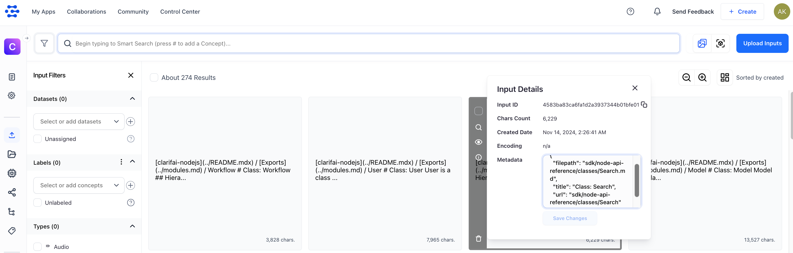

# 🌀 clarifai-docusaurus 🦖
Unofficial [Clarifai](https://www.clarifai.com/) AI search plugin for [docusaurus](https://docusaurus.io/). This was created as a hackathon project within 24h, so code is not ideal, feel free to improve.

This allows to search your documentation using AI. Specifically, it uses embedding model (running as part of Clarifai workflow in the cloud) to index your markdown files (treated as inputs). Generated embeddings are then searched using clarifai public API. 


## Why
1. Compared to traditional text search, this allows to find documents that are relevant by **meaning**.
2. You control indexing of your documents (compared to things like Algolia) and you can delete index as well.
3. You can customize search process yourself as search service runs on your side

## TODOs
- add LRU cache to not hit Clarifai API on every search
- index images & PDFs to have visual search built-in
- have fallback to local text search
- have RAG, so that search could answer questions
- have CI example to have reindexing working automatically

## Installation
1. After having docusaurus installed, add `src/theme/SearchBar.js` to render results. This component should make requests to your locally running search service `proxy-search.js` (replace `localhost:5000` with real production url you will host)

```js
import React, { useState } from 'react';

export default function SearchBarWrapper(props) {

  let [searchResults, setResults] = useState([])

  function search(e) {
    if (e.target.value.length <3) return
  
    // make fetch request to localhost:5000
    fetch('http://localhost:5000/search', {
      method: 'POST',
      headers: {
        'Content-Type': 'application/json',
      },
      body: JSON.stringify({ 
        text: e.target.value,
      }),
    })
      .then((response) => response.json())
      .then((data) => {
        console.log('Success:', data);

        setResults(data)
      })
      .catch((error) => {
        console.error('Error:', error);
      });
  }
  

  return (
    <>
      <input type="text" 
      placeholder="Search" 
      onChange={search}
      onBlur={search} 
      onSubmit={search}
      style={{padding:"7px 15px"}} />

    {searchResults && searchResults.hits && searchResults.hits.length > 0 &&
        <div style={{
            background: "white",
            color: "black",
            padding: 20,
            position: "absolute"
        }}>
            {searchResults.hits.map((hit, index) => {
            return <div key={index}><a
            style={{color: "blue", padding: 3}}
            href={"/" + hit.input.data.metadata.url}>{hit.input.data.metadata.title}</a></div>
            })}
        </div>
    }
    </>
  );
}

```


2. Checkout this repo somewhere close to your docs. 
3. Register in Clarifai and create an app with text workflow.
4. Create `.env` file which will reference Clarifai credentials that both `index-files.js` and `proxy-search.js` will use. 
You can get token from app settings that is for example `https://clarifai.com/my-user-123/my-docs/settings` it would look like:

```
CLARIFAI_PAT=dda3555e476742c8a894857a2c9b5170
CLARIFAI_APP_ID=my-docs
CLARIFAI_USER_ID=my-user-123
```

5. Run indexing: `node index-files.js ../my-docusaurus/docs/`. This should post all of .md files to clarifai app. From this UI you can delete indexed inputs as well. Theoretically you can run indexing in CI 🤔



6. Start your search service `node proxy-search.js`. This simply proxies search requests to Clarifai API, so that your tokens are safe.

Happy searching!
