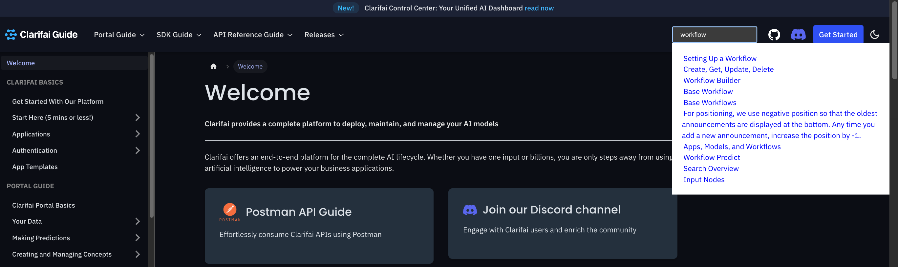

# 🌀 clarifai-docusaurus 🦖
Unofficial [Clarifai](https://www.clarifai.com/) AI search plugin for [docusaurus](https://docusaurus.io/). 
Adds AI search to your docs.




## Overview

```mermaid
flowchart LR

index-files.js --"read .md files one by one"--> docusaurus[(docusaurus files)]
index-files.js --"add .md files with metadata\nPOST /inputs"--> clarifai["<a href="https://clarifai.com">🌀 Clarifai</a>"]
index-files.js --"upload base64 images \n with page metadata"--> clarifai
index-files.js --"post external image urls \n with page metadata"--> clarifai

docusaurus-ui -."include".-> SearchBar.js --"find pages matching query \nPOST /search 'bees'"--> proxy-search.js --"find similar inputs with page metadata\nPOST inputs/searches"--> clarifai
```

## Features
- Indexing of text pages. This scans your `.md` docs and publishes files to Clarifai, which then uses embedding model (running as part of Clarifai workflow in the cloud) to index your markdown files and generates embeddings
- Indexing of images. This uploads base64 images to Clarifai, so that you can search by image content as well.
- Indexing of external images. Similar to local file references, this simply posts external image urls to be indexed for search.
- Search your documentation (.md files) using specified models. Generated embeddings are matched with a vector similarity search using Clarifai public search API.


## Why
1. Compared to traditional text search, this allows to find documents that are relevant by **meaning**.
You can pick which embedding model should be used (multilingual, domain specific etc) and the granularity level (document, paragraph etc).

3. You control indexing time and speed of your documents (compared to crawling done by Algolia for example).
4. You can customize search process yourself as search service runs on your side


## Roadmap
This was created as a hackathon project within 24h, so code is not ideal, feel free to improve.
Whishlist for next steps:

- add LRU cache to not hit Clarifai API on repeated search
- convert to typescript
- add PDFs to have visual search built-in
- have CI example to have reindexing working automatically
- remove index from clarifai on .md file deletion
- have fallback to local text search (for example if search failed or is too slow)
- have RAG, so that search could answer questions, ex. "given these markdown repo, write code that adds new audio file.."
  - needs different UI, large modal for more text, chat history etc
- batching. Currently we post each file separately, but we could batch them to speed up and not hit rate limiter so fast
- tests
- audio (mp3) file matching and search

## Installation
### Search Bar
After having docusaurus installed, copy `SearchBar.js` to your repo `src/theme/SearchBar.js` to render results. 
This component should make requests to your locally running search service `proxy-search.js` (replace `localhost:5000` with real production url you will host)


(Optional) To position input in the sidebar, edit docusaurus config and set under themeConfig.navbar.items:
```json
{
  "type": "search",
  "position": "right"
}
```


### Indexing
1. Checkout this repo somewhere close to your docs. 
2. Register in Clarifai and create an app with text workflow.
3. Create `.env` file which will reference Clarifai credentials that both `index-files.js` and `proxy-search.js` will use. 
You can get token from app settings that is for example `https://clarifai.com/my-user-123/my-docs/settings` it would look like:

```
CLARIFAI_PAT=dda3555e476742c8a894857a2c9b5170
CLARIFAI_APP_ID=my-docs
CLARIFAI_USER_ID=my-user-123
```

Run indexing: 
```bash
node index-files.js ../my-docusaurus/docs/
```

This should post all of .md files to clarifai app. From this UI you can delete indexed inputs as well. Theoretically you can run indexing in CI 🤔


6. Start your search service `node proxy-search.js`. This simply proxies search requests to Clarifai API, so that your tokens are safe.

Happy searching!
